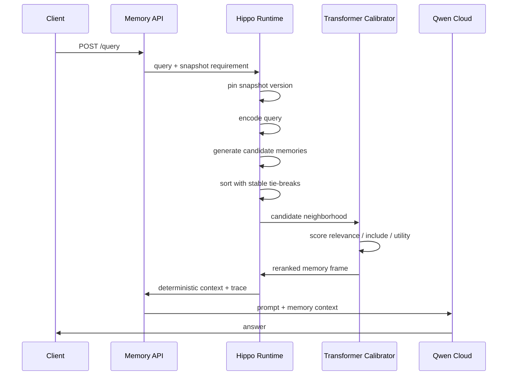
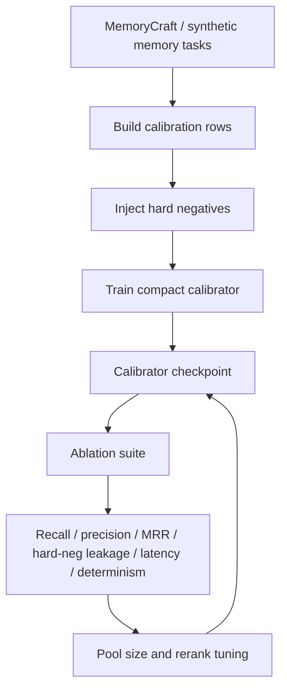

# Hippo-Qwen Architecture

Hippo-Qwen is a deterministic memory layer for AI agents. The core idea is to
separate the generative model from the memory decision system: Qwen reasons over
the final context, while Hippo decides which memories are reliable enough to
enter that context.

## System Diagram

```mermaid
flowchart LR
    user[User / Agent Client] --> api[Memory API]
    api --> write[Memory Write Path]
    api --> query[Query Path]

    subgraph write_path[Deterministic Write Path]
        write --> normalize[Normalize event]
        normalize --> wal[Append-only mutation log]
        wal --> encode[Hippo encoder]
        encode --> index[Deterministic memory index]
        index --> snapshot[Versioned snapshot]
    end

    subgraph query_path[Deterministic Retrieval Path]
        query --> pin[Pin snapshot version]
        pin --> qencode[Encode query]
        qencode --> candidates[Candidate generation]
        candidates --> order[Stable candidate ordering]
        order --> calibrator[Compact transformer calibrator]
        calibrator --> frame[Ranked memory context frame]
    end

    frame --> qwen[Qwen Cloud Agent]
    qwen --> response[Agent response]
    response --> feedback[Feedback / correction event]
    feedback --> api

    snapshot --> candidates
```



## Retrieval Flow



## Training And Evaluation Loop



## Determinism Boundary

Hippo-Qwen treats memory as versioned state:

- writes enter through an append-only mutation log
- each mutation gets a deterministic sequence
- reads pin a snapshot version
- candidate ordering uses stable IDs for tie-breaks
- model and index versions are recorded
- repeated searches report determinism mismatches

The practical target is:

```text
same memory state + same query = same retrieval result
same memory state + same mutation event = same next memory state
```

## What Qwen Does

Qwen should not be responsible for raw memory search. Qwen is used after Hippo
has selected a compact, reliable context frame:

- answer the user with the retrieved context
- summarize new memories before storage
- propose corrections or forgetting actions
- act as a teacher/evaluator in offline training

This keeps the runtime memory path reproducible while still using Qwen for
reasoning and natural language tasks.

## Current Demo Shape

```text
POST /memories
  -> append user/project/compliance/coding memory

POST /query
  -> retrieve deterministic context
  -> return ranked memories and trace
  -> send context to Qwen

POST /feedback
  -> mark memory useful, ignored, corrected, stale
  -> update future deterministic snapshots
```

## Why This Is Different From Plain Vector Search

Vector search answers: "which vectors are nearest?"

Hippo-Qwen answers: "which memories should the agent actually trust?"

That distinction matters in noisy memory environments with stale notes,
near-duplicates, corrections, query-shaped decoys, and similar-but-wrong context.
