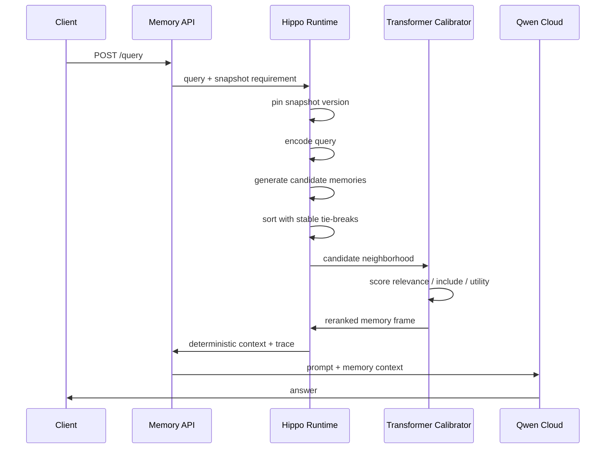
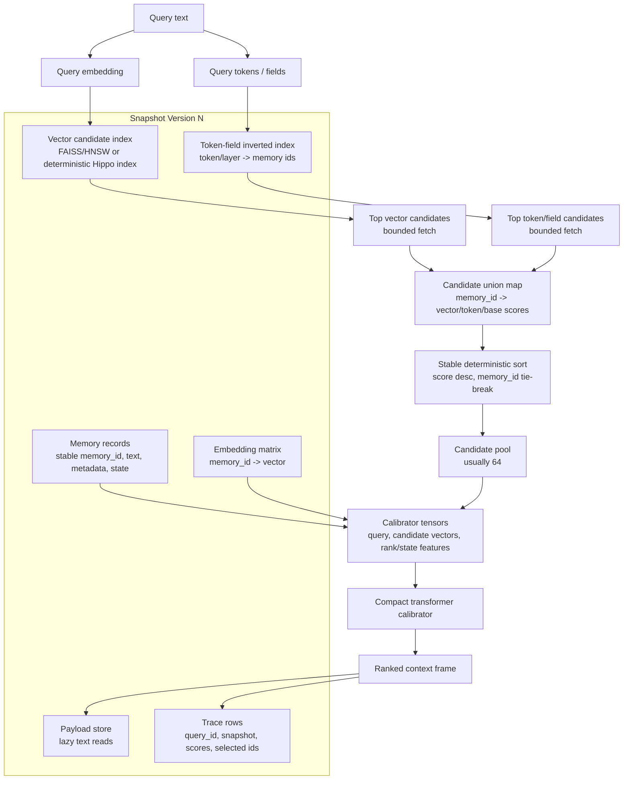
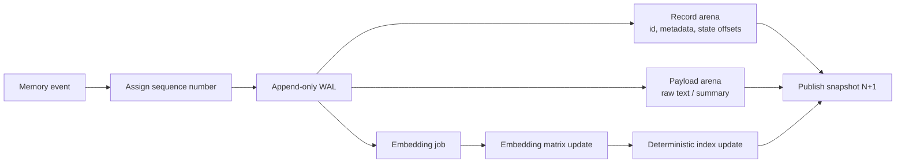
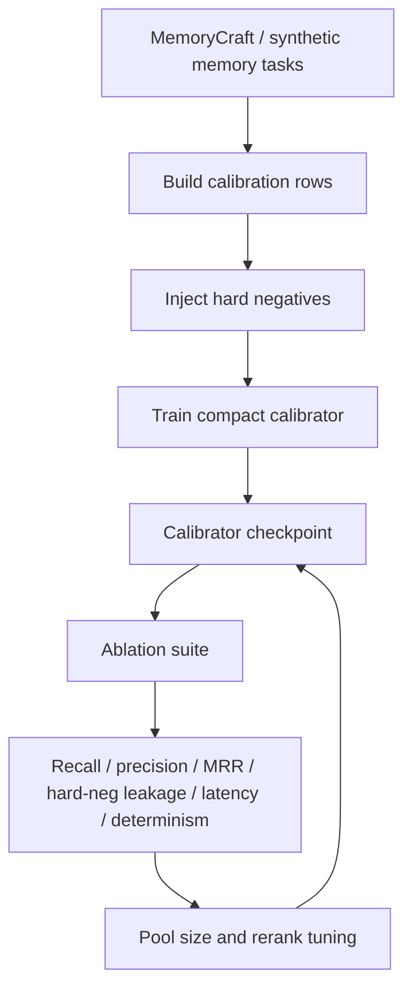

# Hippo-Qwen Architecture

Hippo-Qwen is a deterministic memory layer for AI agents. The core idea is to
separate the generative model from the memory decision system: Qwen reasons over
the final context, while Hippo decides which memories are reliable enough to
enter that context.

## System Diagram

```mermaid
flowchart LR
    user[User / Agent Client] --> api[Memory API]
    api --> write[Memory Write Path]
    api --> query[Query Path]

    subgraph write_path[Deterministic Write Path]
        write --> normalize[Normalize event]
        normalize --> wal[Append-only mutation log]
        wal --> encode[Hippo encoder]
        encode --> index[Deterministic memory index]
        index --> snapshot[Versioned snapshot]
    end

    subgraph query_path[Deterministic Retrieval Path]
        query --> pin[Pin snapshot version]
        pin --> qencode[Encode query]
        qencode --> candidates[Candidate generation]
        candidates --> order[Stable candidate ordering]
        order --> calibrator[Compact transformer calibrator]
        calibrator --> frame[Ranked memory context frame]
    end

    frame --> qwen[Qwen Cloud Agent]
    qwen --> response[Agent response]
    response --> feedback[Feedback / correction event]
    feedback --> api

    snapshot --> candidates
```



## Retrieval Flow



## Hot-Path Data Structures

The runtime is designed around a two-stage retrieval path:

1. Cheap candidate generation pulls a bounded candidate set from compact indexes.
2. A small calibrator spends more compute only on that bounded neighborhood.



### Why This Stays Relatively Quick

- The expensive transformer does not scan all memories. It reranks a small pool,
  currently `64` candidates by default.
- Vector and token indexes are used as candidate generators, not as the final
  source of truth.
- Payload text is read after ranking, so the hot path works mostly with IDs,
  vectors, and compact features.
- Stable ordering means ties are deterministic and debuggable.
- The returned frame is bounded by the context budget, not by the number of
  memories in storage.

### Why It Is More Informative Than Plain ANN

The calibrator receives more than vector distance:

- base rank and base score
- query/candidate embedding interaction
- token overlap
- memory importance
- use count
- evidence count
- age and recency features
- last outcome, such as helpful, ignored, or corrected
- conflict/decoy markers learned from hard-negative training

That lets Hippo-Qwen learn that a nearby memory can still be wrong if it is
stale, corrected, query-shaped, or from the wrong context.

## Write-Side State



This is the part that protects reproducibility. The intended production service
should publish immutable snapshots and answer reads against a pinned snapshot,
while writes advance the log in a single deterministic order.

## Training And Evaluation Loop



## Determinism Boundary

Hippo-Qwen treats memory as versioned state:

- writes enter through an append-only mutation log
- each mutation gets a deterministic sequence
- reads pin a snapshot version
- candidate ordering uses stable IDs for tie-breaks
- model and index versions are recorded
- repeated searches report determinism mismatches

The practical target is:

```text
same memory state + same query = same retrieval result
same memory state + same mutation event = same next memory state
```

## What Qwen Does

Qwen should not be responsible for raw memory search. Qwen is used after Hippo
has selected a compact, reliable context frame:

- answer the user with the retrieved context
- summarize new memories before storage
- propose corrections or forgetting actions
- act as a teacher/evaluator in offline training

This keeps the runtime memory path reproducible while still using Qwen for
reasoning and natural language tasks.

## Current Demo Shape

```text
POST /memories
  -> append user/project/compliance/coding memory

POST /query
  -> retrieve deterministic context
  -> return ranked memories and trace
  -> send context to Qwen

POST /feedback
  -> mark memory useful, ignored, corrected, stale
  -> update future deterministic snapshots
```

## Why This Is Different From Plain Vector Search

Vector search answers: "which vectors are nearest?"

Hippo-Qwen answers: "which memories should the agent actually trust?"

That distinction matters in noisy memory environments with stale notes,
near-duplicates, corrections, query-shaped decoys, and similar-but-wrong context.
